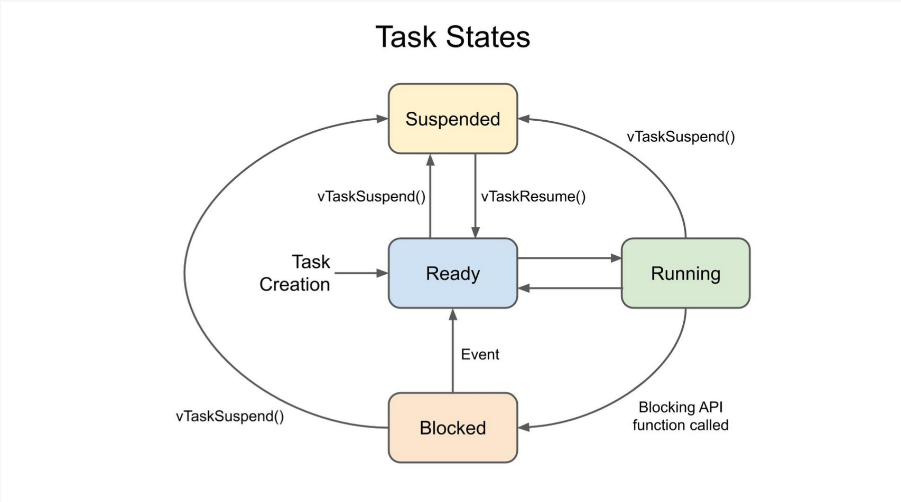

# ESP32 FreeRTOS Exploration Project

This repository contains various examples of FreeRTOS functionality on ESP32 microcontrollers. The project demonstrates core FreeRTOS concepts including task creation, scheduling, synchronization, and inter-task communication.




## Project Structure

The project contains multiple standalone programs, each demonstrating different ESP32 and FreeRTOS capabilities:

- **main.cpp**: Combined example with LED blinking, LCD countdown, and serial input control
- **display.cpp**: I2C LCD countdown timer example
- **ledtask.cpp**: LED blinking with variable delay controlled via serial input
- **led.cpp**: Simple LED blinking example
- **multitask.cpp**: Demonstration of multiple tasks running concurrently with different priorities
- **TimerLed.cpp**: LED control using FreeRTOS timers

## Hardware Requirements

- ESP32 development board
- Optional: I2C LCD display (16x2) for display.cpp and main.cpp
- Built-in LED or external LED connected to GPIO2

## Dependencies

- PlatformIO environment
- Arduino framework for ESP32
- LiquidCrystal_I2C library (for LCD examples)

## Configuration

The project uses platformio.ini for configuration:

```ini
[env:esp32dev]
platform = espressif32
board = esp32dev
framework = arduino
monitor_speed = 115200
build_src_filter = +<main.cpp>  ; Change this to compile a different file
lib_deps = 
    marcoschwartz/LiquidCrystal_I2C @ ^1.1.4
```

To compile a specific file, change the `build_src_filter` line to point to the desired source file:

```ini
build_src_filter = +<display.cpp>  ; To compile display.cpp
```

## Running the Examples

1. Clone this repository
2. Open the project in PlatformIO
3. Edit platformio.ini to select which example to compile
4. Connect your ESP32 board
5. Build and upload the code:
   ```
   platformio run --target upload
   ```
6. Open the serial monitor at 115200 baud for output:
   ```
   platformio device monitor
   ```

## Examples Explained

### main.cpp - Combined Demo

Demonstrates multitasking with three concurrent tasks:
- LED blinking task
- LCD countdown timer task
- Serial input task for controlling LED blink rate

**Hardware Connections:**
- LED on GPIO2
- I2C LCD: SDA to GPIO21, SCL to GPIO22

**Usage:**
Enter a number in the serial monitor to change the LED blink rate (in milliseconds).

### display.cpp - LCD Countdown Timer

Shows a countdown timer on an I2C LCD display.

**Hardware Connections:**
- I2C LCD: SDA to GPIO21, SCL to GPIO22

### ledtask.cpp - Variable Rate LED Blinking

Demonstrates an LED blinking task with serial control of the blink rate.

**Hardware Connections:**
- LED on GPIO2

**Usage:**
Enter a number in the serial monitor to change the LED blink rate.

### multitask.cpp - Task Management Demo

Shows how to create, suspend, resume, and delete tasks in FreeRTOS.

- Creates two tasks with different priorities
- Task1: Prints "Hello from Task" message
- Task2: Prints asterisks
- Demonstrates task suspension and resumption
- Shows how to delete a task

### mutex.cpp - Race Condition and Mutex Synchronization

Demonstrates race conditions in concurrent programming and how to solve them using mutexes (mutual exclusion semaphores).

- Two tasks attempt to increment the same shared counter
- Without protection, race conditions occur when tasks interfere with each other
- Mutex protection ensures that only one task can access the shared resource at a time
- Demonstrates the proper use of `xSemaphoreTake()` and `xSemaphoreGive()`

**Race Condition Explained:**
A race condition occurs when multiple tasks try to read, modify, and write shared data concurrently:
1. Task1 reads the counter (value = 5)
2. Task2 reads the counter (also sees value = 5)
3. Task1 increments and writes back (counter = 6)
4. Task2 increments and writes back (counter = 6) - the increment from Task1 is lost!

**Mutex Solution:**
```cpp
if (xSemaphoreTake(mutex, timeout) == pdTRUE) {
    // Critical section - protected code
    int local = sharedCounter;
    local++;
    sharedCounter = local;
    
    xSemaphoreGive(mutex); // Release the mutex
}
```

This ensures only one task can update the counter at a time, preventing data corruption.

## FreeRTOS Concepts Demonstrated

1. **Task Creation**: Using `xTaskCreatePinnedToCore()` to create tasks
2. **Task Management**: Suspending, resuming, and deleting tasks
3. **Multitasking**: Running multiple independent tasks concurrently
4. **Task Synchronization**: Using delays and priorities to coordinate tasks
5. **Inter-task Communication**: Sharing data between tasks with global variables
6. **Core Pinning**: Specifying which CPU core runs each task
7. **Race Conditions**: Understanding and identifying race conditions in concurrent systems
8. **Mutex Semaphores**: Using mutexes to protect shared resources and prevent race conditions
9. **Critical Sections**: Implementing protected code regions that cannot be interrupted by other tasks

## Future Additions

This project will continue to expand with more examples of FreeRTOS features:
- Other types of inter-task communication
- Binary semaphores and counting semaphores
- Task notifications
- Event groups
- Software timers

## Author

Prashant Bhandari